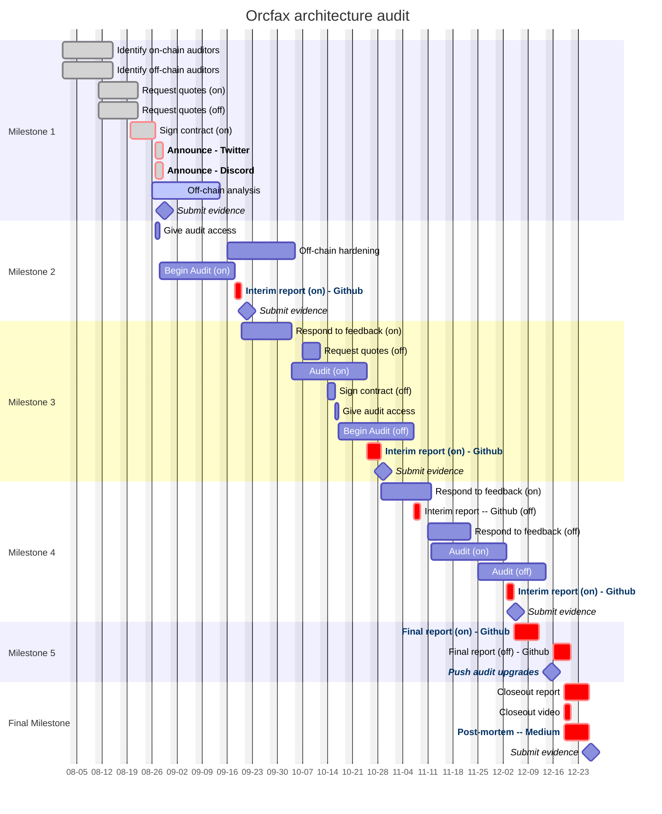

# Orcfax architecture audit

An audit funded through the Catalyst F12 campaign.

This page will provide documentation pertaining to the execution of the proposal
and links to each of the deliverables required for their respective Milestones.
The full Catalyst proposal can be found [here][cat-1].

[cat-1]: https://projectcatalyst.io/funds/12/f12-cardano-use-cases-product/orcfax-architecture-audit

## Problem statement

Cardano dApps use Orcfax oracle data to trigger transactions with significant
financial outcomes. Their users need assurance from a qualified auditor that
Orcfax delivers authentic and accurate data.

### Proposed solution

Orcfax will procure auditing services for its on-chain and off-chain
architecture, perform fixes and enhancements as per auditor recommendations and
report on the audit status and outcomes.

## Project management

## Milestone 1

Orcfax will leverage best practice and precedence within the Cardano ecosystem
to identify auditing firms for and request for the Orcfax architecture audit.

Once identified, Orcfax will finalize a Contract for Services with the selected
audit firm.

### On-chain

Orcfax contacted several auditing firms in order to receive quotes for
performing an audit of its on-chain components.

Our team has selected [TxPipe][m1-1] to go forward with the audit and
successfully signed a contract for services in August of 2024.

* Announcement on [X][m1-2]
* Announcement on [Discord][m1-3]

[m1-1]: https://txpipe.io/
[m1-2]: https://x.com/orcfax/status/1828499168609837088
[m1-3]: https://discord.com/channels/918870284331802674/1082742450268942386/1278059047571951738

### Off-chain

Orcfax contacted institutions in order to receive a quote for performing an
audit of its off-chain components; one of these firms identified several key
areas which Orcfax can address in house before moving forward with the audit
in order to minimize costs.

Our team has begun with a off-chain component analysis and will follow this
review with component hardening.

## Milestone 2

Auditors will release feedback relating to the first review round; this feedback
will be formatted into an audit status report.

## Milestone 3

Orcfax will respond to feedback with code pull requests for software fixes and
enhancements that address any concerns highlighted in the audit feedback.

Auditors will execute a secondary review of Orcfax architecture once the above
changes are committed.

## Milestone 4

If Orcfax has passed its Audit, then proceed to final milestone, otherwise

Orcfax will review secondary review feedback from auditors, formatted into an
audit status report, which assessed changes made in response to the previous
feedback.

If necessary, Orcfax will complete code pull requests for software fixes and
enhancements that address audit concerns in feedback.

## Milestone 5

A final report containing auditor findings, recommendations, and summary of
Orcfax team remediation actions in response to audit.

## Final Milestone
