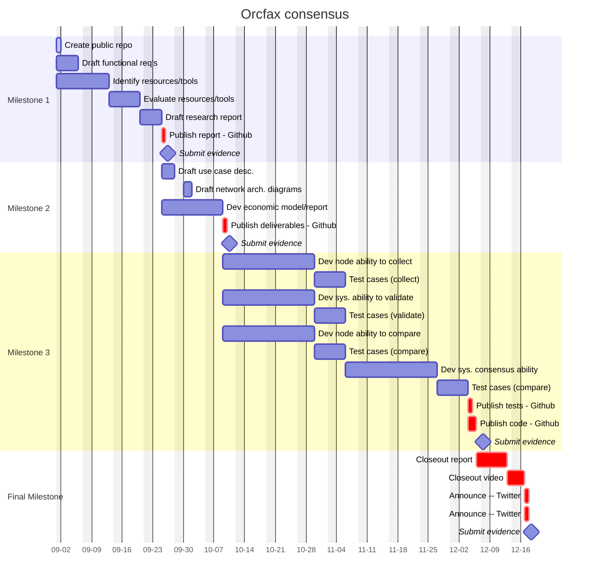

# Orcfax validators: reaching L2 consensus

R&D into Orxfax Network consensus funded through the Catalyst F12 campaign.

This page will provide documentation pertaining to the execution of the proposal
and links to each of the deliverables required for their respective Milestones.
The full Catalyst proposal can be found [here][cat-1].

[cat-1]: https://projectcatalyst.io/funds/12/f12-cardano-use-cases-concept/orcfax-validators-reaching-l2-consensus

## Problem statement

Many Cardano projects need a Layer 2 solution for scaling the performance of
their decentralized consensus logic but they are struggling to understand and
implement appropriate solutions.

### Proposed solution

Orcfax will research Cardano-native and L2 protocols, design an architecture
stack, and develop proof-of-concept software to test the L2 consensus model in
the Orcfax validator network.

## Project management

## Milestone 1

Orcfax will produce a qualitative research report which evaluates current L2
protocols and tools available to Cardano projects With the hope of using this
to inform proof-of-concept development.

## Milestone 2

Orcfax will produce the following:

* economic model report
* use case descriptions
* network architecture diagrams

## Milestone 3

Orcfax will produce software code that demonstrates how a validator node
operator can:

* receive external source data
* apply validation logic
* compare results with other nodes in the L2 network
* arrive at consensus on datum value

## Final Milestone
