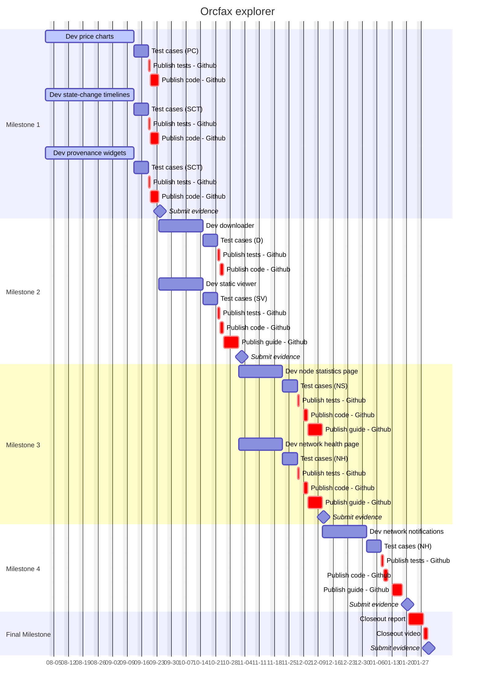

# Orcfax Explorer: Improving "Trust But Verify

An Explorer feature suite upgrade funded through the Catalyst F12 campaign.

This page will provide documentation pertaining to the execution of the proposal
and links to each of the deliverables required for their respective Milestones.
The full Catalyst proposal can be found [here][cat-1].

[cat-1]: https://projectcatalyst.io/funds/12/f12-cardano-use-cases-product/orcfax-explorer-improving-trust-but-verify

## Problem statement

Users that rely on external oracle data to trigger their DeFi financial
transactions need assurances that it can be trusted, but this information is
difficult for a human to trace and read.

### Proposed solution

The Orcfax Explorer allows users to “trust but verify” the oracle data that
their Cardano dApps use. We will enhance it with visualizations, audit log
downloads, real-time stats and incident reports.

## Project management

## Milestone 1

Orcfax will develop a dashboard page on the Orcfax Explorer that utilizes highly
informative visualizations to aid users.

## Milestone 2

Orcfax will develop a new feature for the Orcfax Explorer which allows users to
download and read the audit log package for a given fact statement.

## Milestone 3

Orcfax will develop a dashboard page on the Orcfax Explorer that displays
information about Orcfax network activity in real time

## Milestone 4

Orcfax will develop a new Orcfax Explorer feature which notifies users in the
event of a network issue, and provides users with links to incident reports.

## Final Milestone

