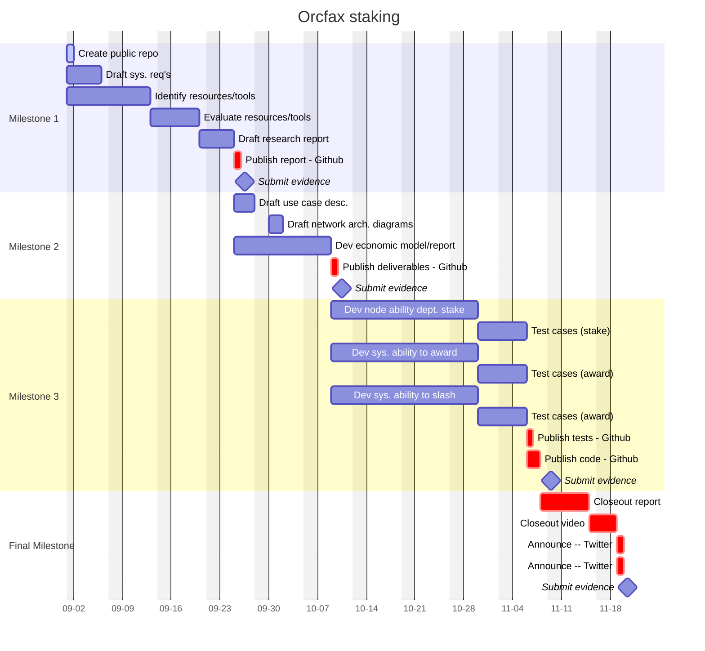

# Orcfax staking: rewarding good behaviour

R&D into Orxfax Network staking funded through the Catalyst F12 campaign.

This page will provide documentation pertaining to the execution of the proposal
and links to each of the deliverables required for their respective Milestones.
The full Catalyst proposal can be found [here][cat-1].

[cat-1]: https://projectcatalyst.io/funds/12/f12-cardano-use-cases-concept/orcfax-staking-rewarding-good-behaviour

## Problem statement

Game theory remains under-utilized within Cardano. As we progress to full
decentralization, Cardano dApps need more tools and protocols to incentivize
desired behaviour while mitigating bad actors.

### Proposed solution

Orcfax will research staking mechanisms for Web3 networks, design an
architecture stack of relevant tools and protocols, and develop a proof of
concept for testing in our validator network.

## Project management

## Milestone 1

Orcfax will produce a qualitative research report which evaluates current Web3
staking protocols and tools available to Cardano projects.

## Milestone 2

Orcfax will produce the following:

* Economic model report
* Use case descriptions
* Network architecture diagrams

## Milestone 3

Orcfax will produce software code that demonstrates how a validator node
operator can:

* deposit testFACT stake
* receive testFACT rewards
* have testFACT slashed for non-conformant behaviour

## Final Milestone
