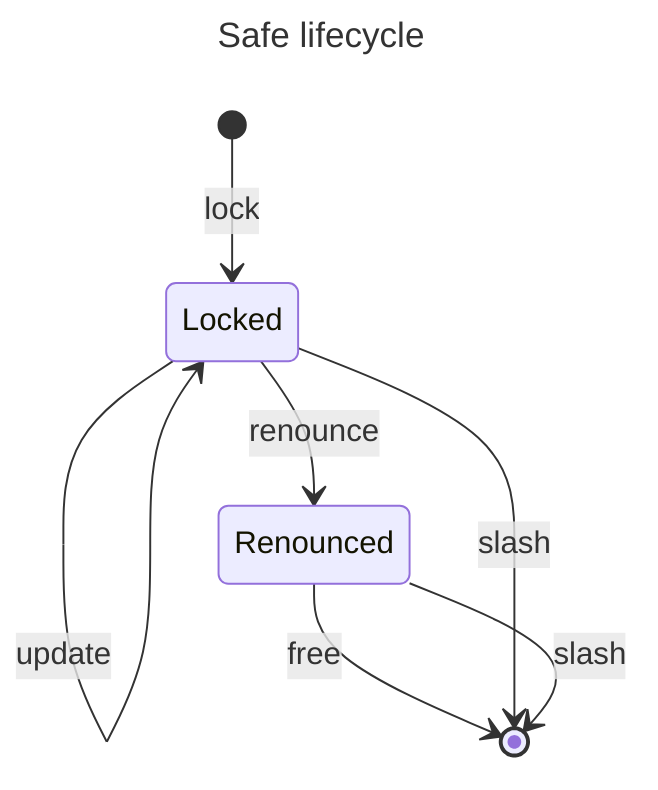
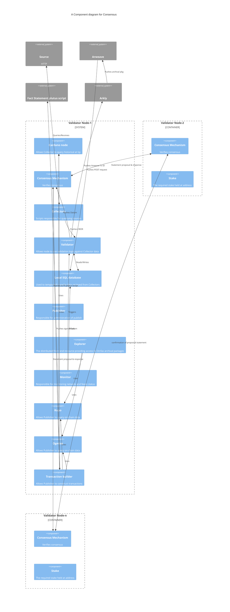

# EchoNet: considerations for the economy of a decentralized network

The following will seek to assess the economic implications for Orcfax as it
continues research and development into maturing its decentralized network of
validator nodes, known as EchoNet, through the integration of staking and
consensus mechanisms. Where necessary, specific considerations relating to
staking and consensus in terms of economic impacts or their requirements will be
addressed separately, however the two mechanisms share considerable overlap in
both areas; for this reason, unless addressed separately, the following applies
to both.

## 1. Context

A decentralized service is a service provided by a set of separate autonomous
participants that are not subject to a hierarchy. Within the network of
participants, the majority share the common purpose of providing a good service.
However, some participants may be incompetent or even have malign intent.
Because of this possibility, each is suspicious of the others. This network of
mutually suspicious participants must coordinate the running of a distributed
service. Orcfax endeavors to develop such a system in order to migrate its
current mainnet oracle services to a fully decentralized solution for Cardano.

Part of an overall design of such a system is providing tooling which enables
them to reach agreement over various network related tasks; this is consensus.
The design must also ensure that participants in that process are rewarded for
the good service they provide and are strongly discouraged from behaving badly;
staking is the term we use to encapsulate the process governing this aspect of a
decentralized service.

## 2. Use cases

The number of projects which may benefit from the deliverables coming out of the
f12 proposals pertaining to consensus and staking are numerous; this is because
the deliverables are useful for any project which desires to move complexity off
the L1 and requires a set of participants to provide a service, on behalf of the
project, in a decentralized manner.

It's easy to imagine projects which might wish to build upon existing web2
services and to make them more publicly transparent, or their records more
secure, by decentralizing them. A decentralized weather forecast service, flood
insurance claims, digital gambling, and verified sports scores could be
meaningfully improvised by a network of participants that were responsible for
corroborating their data prior to leveraging it on the L1; many could also
decide that those with the ability to corroborate data with financial value,
need to stake something of value themselves in order to deter bad behaviour. The
users or consumers of such service would benefit from increased protection
against erroneous data, improperly executed transactions, and they may feel more
secure in the knowledge that bad actors are financially impacted by their
actions.

The incorporation of either of these components by other projects would also
mark their commitment to decentralization and the desire to increase overall
transparency, both of which are valued qualities among the Cardano community.

The number of potential use cases are numerous and as projects on cardano
continue to innovate, the number will continue to increase. Knowing this, the
design of the consensus and staking proof of concepts continue to be executed in
such a way that while in context of this proposal, the service provision is an
oracle, it need not be and could be applied to many other project use cases as
these mechanisms are primarily off-chain. It being our hope that this modular
approach should allow for greater integrator flexibility across use cases.

Each PoC also black-boxes the other, so while the Orcfax use case will utilize
both a staking and consensus mechanism, others may choose to leverage them
independently. Our team has elected to design these PoC's in this fashion
because we understand that The deliverables from these projects have broad
utility and may be used by projects offering diverse services to their users.

### 2.1 Specific considerations for Staking

Projects assessing the implementation of a decentralized network may assume that
most participants will be honest and competent, and that they will continue to
participate honestly and with competence providing participation is
straightforward and financially neutral. However, they are without hierarchy or
a priori obligation to provide this service or cooperate with one another.

This is why the output system must provide the incentive structure that, under
these assumptions, will result in the expected service.

A participant's behaviour is accounted for: good behaviour that aids the quality
of service provision is measured, as is bad behaviour. We can assume that the
participants are able to reach consensus on these accounts and produce a
signature/signatures as proof of general acceptance. This happens periodically -
say once every 24 hours.

The rewards for good behaviour and service are paid out from a 'treasury' and
forfeit funds are paid to the treasury. The currency will be a native asset. The
project output should include the scripts governing these aspects of the
treasury. For use cases beyond an oracle service, we will assume the treasury is
sufficiently funded to meet the burden of conveying rewards. More details
regarding the Orcfax specific use case and the treasury from which we will pay
rewards will be covered in a later section.

## 3. Orcfax staking: rewarding good behaviour

Orcfax is an aspiring decentralized Oracle service. To participate within the
network, a participant must be in possession of two types of Cardano native
assets:

-   One Orcfax Validator License, one of 100 NFTs
-   At least 500,000 \$FACT

Participants are strongly discouraged from behaving badly through the use of
slashing. A participant must first put 'at stake' some asset(s). If the
participant's actions are deemed bad, some or all of their assets are forfeit
through a slashing mechanism.

To incentivize good behavior, a participant receives rewards proportionate to
their good service.

However, when balancing incentives and penalties for participants, care must be
taken. The wrong incentive structure may either:

-   cause a race to the top. Rewards only go to a few participants. Eventually
    this leads to centralization which degrades robustness.
-   cause a race to the bottom. Participants are rewarded even if they are poor
    service providers.

Both are bad for the long term health of the service.

### 3.1 Staking components overview

The following are the key components of the consensus PoC:

1. Constitution - holds the signing key.
1. Hold - rewards awaiting collection.
1. Safe - locks a participants funds.
1. Treasury - holds funds awaiting dispensing.
1. Dispenser - manages the dispensing of rewards.

:::info[N.B.]

The following sections will be updated to reflect final design decisions made in
milestone 3.

:::

#### 3.1.1 The Constitution

The constitution holds any dynamic data required by the protocol. This is a
simple, classic design consisting of a multipurpose script with spend and mint
purpose. The script is seeded so that it can only be initiated once.

A validity token (NFT) is locked at the script, its utxo's inlined datum
contains the pubkey. It can be spent only if the pubkey signs the transaction.

If the tokens are not burnt in the transaction, then the validity token must be
output to the same address.

#### 3.1.2 The Safe

The safe holds participants' funds. These are at risk if the participant is
deemed to behave badly. It is also required to claim rewards.

A participant locks funds in (an instance of) a **safe**. While it exists, it is
represented on the L1 tip by a single utxo.

This is the basic lifecycle of a safe.

First, participants take part in a decentralized key generation (DKG) process.
The output of the DKG is one key pair for each participant as well as a single
collective pubkey. The signature generation procedure requires multiple
coordinated rounds. We'll call this the 'signature dance'. The output of the
signature dance is a single signature. On-chain verification of the signature
with the collective pubkey is indistinguishable from that of a 'vanilla'
signature.

We may assume that off-chain, the participants are able to organise a DKG, and
will organise FROST style signing of the rewards and slashing data. Each
individual pubkey can then be used to identify the participant. The collective
pubkey is used to verify the signature.

If the participant is satisfied with the DKG step they perform a `lock` step.
This initialises the safe. It is now `Locked` with the owners keys in the datum.

While `Locked` the owner may `update` the safe with new keys.

If the participant wishes to no longer participate, they `renounce`. The safe is
now `Renounced`.

All participants should be watching the chain for `renounce` actions, as they
should no longer accept signatures associated with the renouncer. The `renounce`
begins a limited period of time where the other participants can still apply
penalties.

Once this time period has elapsed, the participant may `free` their locked
funds. All funds are again at the participants disposal.

If sufficient participants deem a participant with either a `Locked` or
`Renounced` safe to have acted badly, they can produce a slash transaction. This
empties the contents of the safe into the treasury. The script ensures this is
permitted only when signed by the constitution.

#### 3.1.3 The Hold

The `Hold` is a simple script which "holds" rewards until they are claimed.

A utxo at the `Hold` address has an inline datum indicating to which safe owner
it belongs.

#### 3.1.4 The Dispenser

The dispenser facilitates the dispensing of rewards to the `Hold`.

## 4. Orcfax validators: reaching L2 consensus

The economics of consensus look quite different. The focus here is in
understanding the cost of validator participation, the cost to a validator when
slashed, and the potential benefits of performing maliciously. If the potential
profit of providing bad information outweighs the cost, validator nodes become
financially incentivized to act badly, which would result in significant risk to
network integrity.

At the time of this writing, the cost of acquiring 500,000 FACT tokens is
approximately 5,025 ADA or 5,577 USD. The floor price for a Orcfax Validator
License is 10,500 ADA or 11,653 USD. This means that the cumulative stake
required to participate has a value of approximately 17,230 USD.

In order to combat the risks associated with validators having financial
incentive to act badly, Orcfax is tasked with devising a strategy by which
malicious behavior becomes cost prohibitive or disadvantageous. However, at this
stage of research and development, Orcfax has not yet decided on the process
through which consensus will be reached over a given fact statement; the
different ways this might be orchestrated have implications on how malicious
behavior may need to be addressed. For this reason, we will explore two options:
1.) where one node proposes a statement, and a subset of the 100 nodes within
the network verifies that statement; 2.) where all nodes within a randomly
selected subset propose a statement, and the median entry is selected.

In the first, where a proposer has their statements verified by a subset of $n$
nodes, the cost of the lie (using the values given above) becomes $n * 17,230$
USD. So, in a system where the threshold for verification was 10 nodes, the cost
of the lie is more than 170,000 USD.

However, if instead of requiring any subset for verification we had the $n$
nodes selected at random, then the lie becomes significantly more expensive.
With random selection of subset nodes, even If the bad actor corrupted 10 of the
total 100 nodes, it still becomes very unlikely that those 10 would be randomly
selected.

In the second scenario where a subset of nodes is randomly selected, each
proposes a statement, and the median is selected, the cost of the lie at a
minimum is $((n + 1) / 2) * 17,230$ USD or the value of half the selected nodes
+1. So in a case where, from 100 nodes, a subset of 21 are selected at random,
the cost of the lie would be nearly 190,000 USD.

But again, the fact that this subset of nodes is selected at random means that
these costs are the minimum. Even with a bad actor having at least 11 licenses,
and the corresponding fact, the probability of them all being selected to
propose within the subset is very slim.

For either of the above scenarios, the value of \$FACT and cost of acquiring a
Validator License have immense impact on the appropriate size of the subset of
nodes; it could very well be that, using the values given previously, it's
necessary to select a subset of 21 (or more) nodes in order to adequately reduce
the risk of bad actors and to make bad behaviour cost prohibitive. However, this
narrative dramatically changes should \$FACT halve in value, or increase 10x.

These are all considerations that Orcfax must weigh as we continue to develop a
consensus solution, especially whether not to incorporate randomness (and how).
These choices will be finalized in the next milestone when development begins.

:::info[N.B.]

This section will be updated to reflect final design decisions made in
milestone 3.

:::

### 4.1 Contextualizing consensus components

The following demonstrates the various components of a fully decentralized node
within the EchoNet network; "Validator Node-1" shows each of its components
whereas "Validator Node-2" and "Validator Node-n" have been abbreviated in order
to highlight the staking requirements and the connections to each nodes through
the consensus mechanism. The diagram also unpacks the relationships between
components and how they are expected to operate.

:::note

If the diagram is not rendering clearly, or if the text is difficult to read,
viewing the raw content of the page can be very helpful.

:::

## 5. Participation costs

Participants will need to shoulder the cost of either acquiring their own
equipment by which they will participate in the network, or the cost of
maintaining a subscription to cloud infrastructure. While the cost of
implementing the software responsible for consensus and staking is unknown at
this time, the current cost of running a mainnet node within the Orcfax
federated network is approximately 200 USD per month, which should serve as a
basic understanding of costs for network participants; its important to
understand that this approximation of cost is an estimate and may not reflect
the total cost of participation for validators.

:::info[N.B.]

The cost of implementing and running staking and consensus mechanisms remains
unknown because design choices relating to either can have significant impacts;
final design takes place in the next milestone. This section will be updated
after the next milestone and the completion of the PoC's.

:::

## 6. Rewards

Early on in Orcfax development, we established the mechanisms by which
Validators would be onboarded and rewarded for their participation in the
network. Our [tokenomics][r-1] ensured that the biggest allocation of \$FACT was
reserved to reward our decentralized validators for running Orcfax nodes.

Initially, with a relatively low number of integrators, validators will be
rewarded for their participation in the network with \$FACT from the [Validator
Rewards Allocation][r-2] (referred to previously as the "treasury"), which
contains 50% of the total FACT token supply, or 500,000,000 (50%) \$FACT.

However, since consumers (i.e. integrators) pay for on-chain publications in
\$FACT, an increase in the number of integrators will lead to more publications,
thereby driving up the demand for the FACT token. The generated \$FACT payments
will then be distributed to entities crucial for network operation and security,
namely Orcfax Validators.

This means that while validators will be rewarded from the treasury, as the
number of consumers increases, the amount of FACT tokens rewarded from this
allocation per publication will decrease over time Orcfax will reduce emissions
from the treasury and use instead the funds being generated from integrators as
more consumers start using Orcfax oracle feeds; increasing \$FACT payments from
these customers will compensate for the reduced emission from the Validator
Rewards Allocation, and will eventually replace them completely.

The following demonstrates how having integrators pay for feeds in FACT (or ADA)
creates a positive feedback loop and buy pressure for \$FACT. The generated
\$FACT payments from integrators are then distributed to entities crucial for
network operation like Orcfax Validators.

:::note

Consumers will also be able to fund their desired feeds with ADA, but Orcfax
will sell these funds for \$FACT so as to have the same result.

:::

The above is demonstrated in this [model][r-3] which allows for the manipulation
of key variables such as the value of ADA in USD, the value of \$FACT in ADA,
the number of integrators the network services; what results is a projection as
to the rate of treasury emission and how long it takes for funds from
integrators to replace those emissions. For added accessibility, graphs have
been added which demonstrate how these variables and the emission rate decreases
over time as customer fees increase. The model also shows how these calculations
play out over a 10 years span as we are cognizant that the model depends in
large part on the widespread adoption of Orcfax services, which could take
time-- the model takes this possibility into account and demonstrates how the
significant allocation of \$FACT to the treasury allows Orcfax to meet the
burden of paying validators even if the value of \$FACT is volatile.

[r-1]: docs/fact-token/tokenomics.md
[r-2]: docs/fact-token/tokenomics.md#validator-rewards
[r-3]:
    https://docs.google.com/spreadsheets/d/1aH4Zwtn8KUTtrdzBBZFK1_Kulb7_a4uJGjzLhmPTLFc/edit?gid=1934045699#gid=1934045699

## 7. Beyond the PoC

While research for both consensus and staking was completed within budget,
systems analysis and development have, to date, exceeded initial estimates; this
has largely been due to complexities which while foreseen, their scope was not
entirely appreciated. The difference between the budget and actual costs is
being covered by Orcfax.

Going forward, the reality of these cost discrepancies is useful for better
understanding the real cost of any work which may be needed after the successful
completion of catalyst closeout to move both the consensus and staking PoC’s
towards mature software and beyond with the integration of consensus and staking
mechanisms into EchoNet.

These two proposals shared similar funding models during F12; both anticipated
approximately 375 hours for completion. Based on the research completed through
each of the proposals and the limited start made in the development of their
proof of concepts to date, our team projects that it will likely require a
development team of equivalent size, an additional 9 months or 1400 hrs to: 1.)
mature the PoC's to software for mainnet integration; 2.) provide sufficient
integration testing. These hours would likely maintain a similar split between
developers and system analysis/documentation as the f12 proposals if seeking
funding through catalyst.

These estimations are based on early stage understandings which may change
during development in milestone 3. A goal of the project is of course to better
understand these costs as development continues.
