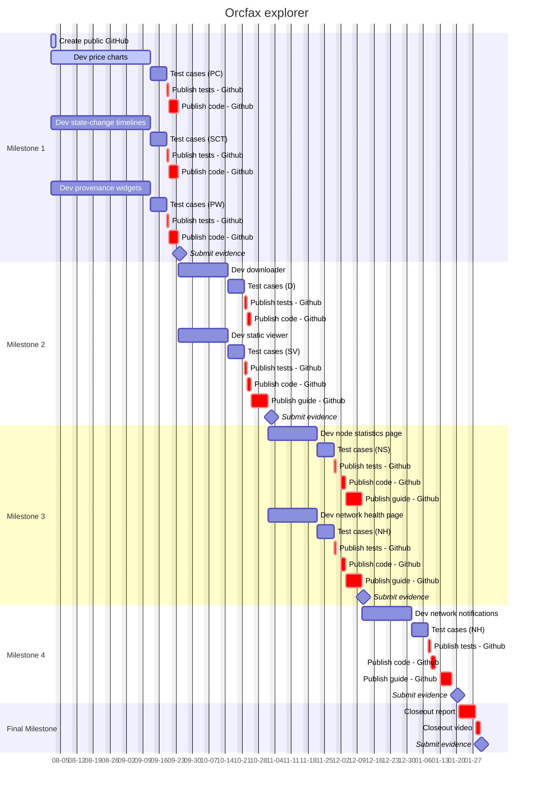

# Orcfax Explorer: Improving "Trust But Verify

An Explorer feature suite upgrade funded through the Catalyst F12 campaign.

This page will provide documentation pertaining to the execution of the proposal
and links to each of the deliverables required for their respective Milestones.
The full Catalyst proposal can be found [here][cat-1].

[cat-1]:
    https://projectcatalyst.io/funds/12/f12-cardano-use-cases-product/orcfax-explorer-improving-trust-but-verify

## Problem statement

Users that rely on external oracle data to trigger their DeFi financial
transactions need assurances that it can be trusted, but this information is
difficult for a human to trace and read.

### Proposed solution

The Orcfax Explorer allows users to "trust but verify" the oracle data that
their Cardano dApps use. We will enhance it with visualizations, audit log
downloads, real-time stats and incident reports.

## Project management

## Milestone 1

Orcfax developed a dashboard page on the Orcfax Explorer that utilizes highly
informative visualizations to aid users in sense making. This dashboard
highlights several new features that were the direct result of this milestone.

What follows is a mapping of <u>what was promised</u> for Milestone 1 to the
<u>newly integrated explorer features</u>. Links will direct readers to
additional context and the relevant code enhancements for each.

-   Orcfax feed price charts
    -   [Feeds list page][m1-1]
    -   [Feed details page][m1-2]
    -   [Feed price charts][m1-3]
-   State change timelines
    -   [Show calculation details on UI][m1-4]
-   Data provenance
    -   [Display sources][m1-5]
    -   [Show collection details on UI][m1-6]
    -   [Show validation details on UI][m1-7]

These Orcfax Explorer upgrades give users an enhanced ability to verify the
authenticity and provenance of the collected data. While this information has
been present within our archival packages from the beginning, these enhancements
aid users by surfacing the salient archival details and visualizing them in a
more accessible manner.

For test cases, we have recorded a walkthrough of the [Orcfax Explorer][m1-8] so
that users can see how the new features work in tandem to deliver an incredible
explorer experience. This walkthrough also serves as a resource for users
looking to better understand the upgrades within the context of the explorer UI.

[m1-1]: https://github.com/orcfax/explorer.orcfax.io/issues/10
[m1-2]: https://github.com/orcfax/explorer.orcfax.io/issues/9
[m1-3]: https://github.com/orcfax/explorer.orcfax.io/issues/8
[m1-4]: https://github.com/orcfax/explorer.orcfax.io/issues/4
[m1-5]: https://github.com/orcfax/explorer.orcfax.io/issues/2
[m1-6]: https://github.com/orcfax/explorer.orcfax.io/issues/3
[m1-7]: https://github.com/orcfax/explorer.orcfax.io/issues/5
[m1-8]: https://explorer.orcfax.io/

## Milestone 2

Orcfax developed new functionality for the Orcfax Explorer which allows users to
download and read the audit log package for a given fact statement offline on
their own computers; this new feature is the Explorer Viewer.

The upgrades which enable this functionality are now included in the public
github explorer [repo][m2-1], along with additional context, source code, tests,
and user documentation to aid in use.

Orcfax published the announcement for our explorer feature upgrade on [X][m2-2]
and [Discord][m2-3].

For test cases, we recorded a walkthrough of the explorer so that users can see
how the new features work in tandem to deliver an incredible Explorer Viewer
experience. This walkthrough also serves as a resource for users looking to
better understand the upgrades within the context of the explorer UI.

[m2-1]: https://github.com/orcfax/explorer.orcfax.io/issues/13
[m2-2]: https://x.com/orcfax/status/1854221701849997411
[m2-3]:
    https://discord.com/channels/918870284331802674/1082742450268942386/1305649489478160454

## Milestone 3

Orcfax will develop a dashboard page on the Orcfax Explorer that displays
information about Orcfax network activity in real time

## Milestone 4

Orcfax will develop a new Orcfax Explorer feature which notifies users in the
event of a network issue, and provides users with links to incident reports.

## Final Milestone
